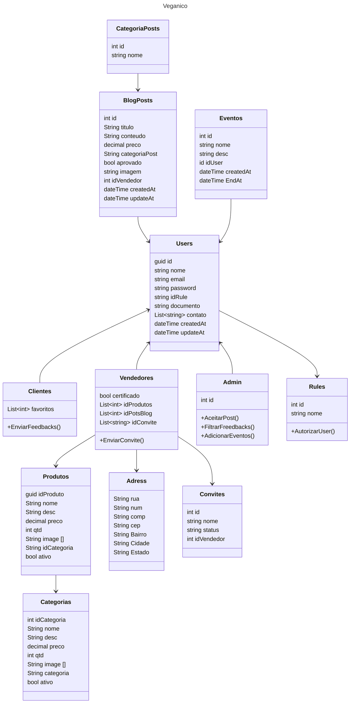

```mermaid
---
title: Veganico
description: Seu marketplace para veganos e produtos organicos
author: Pablo Santos
---
classDiagram
Produtos --> Categorias
Users <-- Clientes
Users <-- Vendedores
Users <-- Admin
Users --> Rules
Vendedores --> Adress
Vendedores --> Convites
Vendedores --> Produtos


BlogPosts --> Users
CategoriaPosts --> BlogPosts

Eventos --> Users

class Users{
    guid id
    string nome
    string email
    string password
    string idRule
    string documento
    List~string~ contato
    dateTime createdAt
    dateTime updateAt
}

class Admin{
    int id
}
Admin: +AceitarPost()
Admin: +FiltrarFreedbacks()
Admin: +AdicionarEventos()

class Clientes{
    List~int~ favoritos
}
Clientes : +EnviarFeedbacks()


class Vendedores{
    bool certificado
    List~int~ idProdutos
    List~int~ idPotsBlog
    List~string~ idConvite
}

Vendedores : +EnviarConvite()


class Rules{
    int id
    string nome
}
Rules: +AutorizarUser()

class Convites {
    int id
    string nome
    string status
    int idVendedor
}

class Adress{
    String rua
    String num
    String comp
    String cep
    String Bairro
    String Cidade
    String Estado
}

class Produtos{
    guid idProduto
    String nome
    String desc
    decimal preco
    int qtd
    String image []
    String idCategoria
    bool ativo
}

class Categorias{
    int idCategoria
    String nome
    String desc
    decimal preco
    int qtd
    String image []
    String categoria
    bool ativo
}


class BlogPosts{
    int id
    String titulo
    String conteudo
    decimal preco
    String categoriaPost
    bool aprovado
    string imagem
    int idVendedor
    dateTime createdAt
    dateTime updateAt
}

class CategoriaPosts{
    int id
    string nome
}

class Eventos{
    int id
    string nome
    string desc
    id idUser
    dateTime createdAt
    dateTime EndAt
}

```
